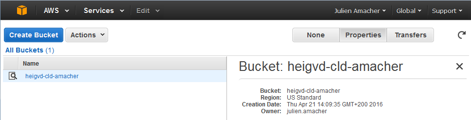
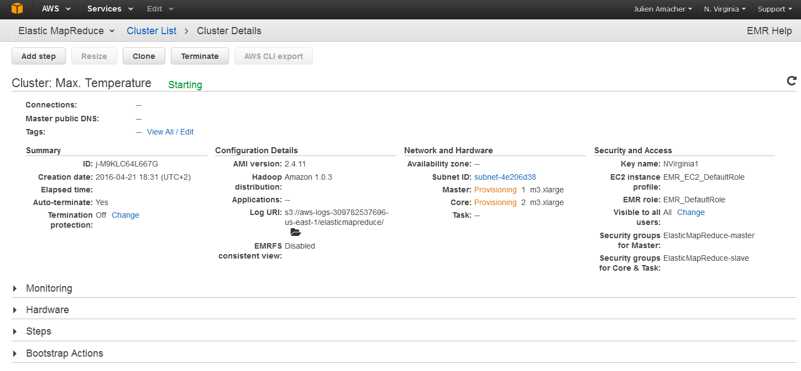
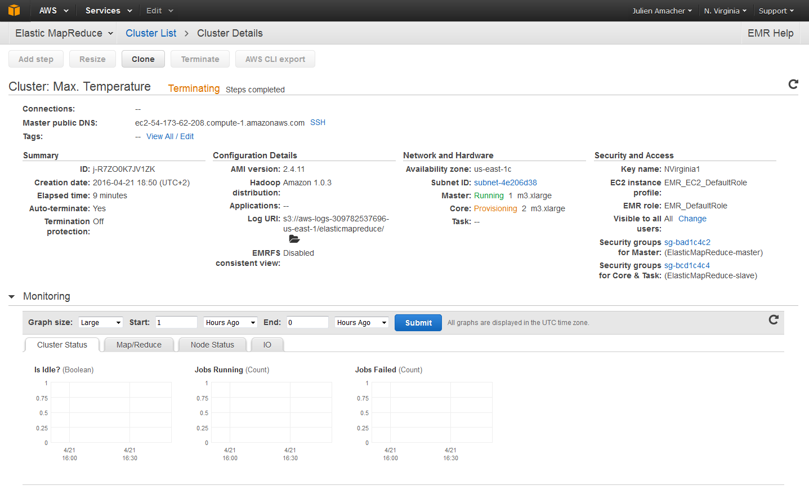
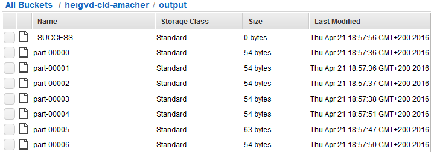
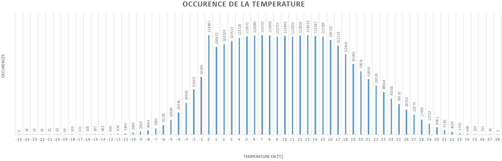

Labo: Lab05 
Date: 2016-04-21 
Students: Julien Amacher, Amine Tayaa

# Task 1

An S3 bucket is created:

We then upload both map and reduce files into the bucket.

3 m3.xlarge EC2 instances were needed:

- $0.266/h for the EC2 instance
- $0.070/h for the EMR

Total: (0.266 + 0.070) * 3 = 1.008$

The cluster is configured as requested:

Important, the output folder must not yet exist.

In the syslog, we only have these counters:

	2016-04-21 16:55:18,185 INFO org.apache.hadoop.streaming.StreamJob (main):  map 0%  reduce 0%
	2016-04-21 16:55:42,245 INFO org.apache.hadoop.streaming.StreamJob (main):  map 3%  reduce 0%
	2016-04-21 16:55:48,258 INFO org.apache.hadoop.streaming.StreamJob (main):  map 9%  reduce 0%
	2016-04-21 16:55:54,271 INFO org.apache.hadoop.streaming.StreamJob (main):  map 14%  reduce 0%
	2016-04-21 16:56:00,284 INFO org.apache.hadoop.streaming.StreamJob (main):  map 20%  reduce 1%
	2016-04-21 16:56:06,297 INFO org.apache.hadoop.streaming.StreamJob (main):  map 26%  reduce 3%
	2016-04-21 16:56:09,304 INFO org.apache.hadoop.streaming.StreamJob (main):  map 26%  reduce 4%
	2016-04-21 16:56:12,310 INFO org.apache.hadoop.streaming.StreamJob (main):  map 31%  reduce 4%
	2016-04-21 16:56:15,316 INFO org.apache.hadoop.streaming.StreamJob (main):  map 31%  reduce 5%
	2016-04-21 16:56:18,323 INFO org.apache.hadoop.streaming.StreamJob (main):  map 37%  reduce 5%
	2016-04-21 16:56:21,329 INFO org.apache.hadoop.streaming.StreamJob (main):  map 37%  reduce 6%
	2016-04-21 16:56:24,335 INFO org.apache.hadoop.streaming.StreamJob (main):  map 42%  reduce 6%
	2016-04-21 16:56:30,348 INFO org.apache.hadoop.streaming.StreamJob (main):  map 48%  reduce 8%
	2016-04-21 16:56:36,360 INFO org.apache.hadoop.streaming.StreamJob (main):  map 53%  reduce 9%
	2016-04-21 16:56:42,372 INFO org.apache.hadoop.streaming.StreamJob (main):  map 59%  reduce 9%
	2016-04-21 16:56:45,378 INFO org.apache.hadoop.streaming.StreamJob (main):  map 59%  reduce 10%
	2016-04-21 16:56:48,384 INFO org.apache.hadoop.streaming.StreamJob (main):  map 65%  reduce 11%
	2016-04-21 16:56:51,391 INFO org.apache.hadoop.streaming.StreamJob (main):  map 65%  reduce 12%
	2016-04-21 16:56:54,396 INFO org.apache.hadoop.streaming.StreamJob (main):  map 70%  reduce 12%
	2016-04-21 16:57:00,409 INFO org.apache.hadoop.streaming.StreamJob (main):  map 76%  reduce 13%
	2016-04-21 16:57:06,422 INFO org.apache.hadoop.streaming.StreamJob (main):  map 81%  reduce 14%
	2016-04-21 16:57:12,434 INFO org.apache.hadoop.streaming.StreamJob (main):  map 87%  reduce 14%
	2016-04-21 16:57:15,440 INFO org.apache.hadoop.streaming.StreamJob (main):  map 87%  reduce 16%
	2016-04-21 16:57:18,446 INFO org.apache.hadoop.streaming.StreamJob (main):  map 93%  reduce 16%
	2016-04-21 16:57:21,453 INFO org.apache.hadoop.streaming.StreamJob (main):  map 93%  reduce 17%
	2016-04-21 16:57:24,459 INFO org.apache.hadoop.streaming.StreamJob (main):  map 98%  reduce 17%
	2016-04-21 16:57:30,471 INFO org.apache.hadoop.streaming.StreamJob (main):  map 100%  reduce 18%
	2016-04-21 16:57:36,483 INFO org.apache.hadoop.streaming.StreamJob (main):  map 100%  reduce 19%
	2016-04-21 16:57:39,489 INFO org.apache.hadoop.streaming.StreamJob (main):  map 100%  reduce 57%
	2016-04-21 16:57:48,507 INFO org.apache.hadoop.streaming.StreamJob (main):  map 100%  reduce 67%
	2016-04-21 16:57:51,512 INFO org.apache.hadoop.streaming.StreamJob (main):  map 100%  reduce 90%
	2016-04-21 16:57:54,518 INFO org.apache.hadoop.streaming.StreamJob (main):  map 100%  reduce 100%

We then concatenate all output files.

Next, we need to sort the output by year:

	sort -k 1 -n concat > sorted

Finally, we graph the data (values need to be divided by ten) :

The maximum value occured in 2003 with 38°C.

Based on the logfile, Hadoop used 24 map processes and 7 reduce processes (hence the 7 output files we obtained) :

	2016-04-21 16:55:17,169 INFO org.apache.hadoop.mapred.JobInProgress (IPC Server handler 5 on 9001): job_201604211653_0001: nMaps=215 nReduces=7 max=-1

The input file containing weather data has 85543660 lines. Each line will be sent to a map process:

	2016-04-21 16:55:17,434 INFO org.apache.hadoop.mapred.JobInProgress (pool-1-thread-1): Input size for job job_201604211653_0001 = 85543660. Number of splits = 215

The output of the reduce procuces, in total, 43 results - one for each year:

	1975	340
	1982	331
	1989	343
	1996	331
	2003	380
	2010	360
	1976	340
	1983	370
	1990	332
	1997	310
	2004	346
	2011	362
	1977	320
	1984	350
	1991	330
	1998	353
	2005	360
	2012	360
	1978	310
	1985	350
	1992	342
	1999	325
	2006	360
	2013	370
	1979	330
	1986	342
	1993	320
	2000	349
	2007	340
	2014	358
	1973	320
	1980	320
	1987	322
	1994	350
	2001	330
	2008	330
	2015	306
	1974	340
	1981	320
	1988	340
	1995	343
	2002	353
	2009	361

# Task 2

The mapper is modified to discard the decimal portion of the temperature:

	#!/usr/bin/env python

	import re
	import sys

	for line in sys.stdin:
	  val = line.strip()
	  (year, temp, q) = (val[15:19], val[87:91], val[92:93])
	  if (temp != "+999" and re.match("[01459]", q)):
	    print "%s\t%s" % (int(temp), 1)

And the reducer keeps an array of temperature occurences and increments it as results come in:

	#!/usr/bin/env python

	import sys

	counts = {}

	def sortonkeynumeric(k):
		try:
			return int(k)
		except ValueError:
			return k

	for line in sys.stdin:
  	(key, val) = line.strip().split("\t")
  
  	cnt = int(val)
	
 	 try:
		counts[key] = counts[key] + cnt
  	except:
		counts[key] = cnt

	# Sorting here is only useful if we only have one reducer. Otherwise we would need to sort after concatenation of each reducer output
	#for temp in sorted(counts.keys(), key=sortonkeynumeric):
	#   print '%s\t%s'% (temp, counts[temp])

	for temp in counts.keys():
		print '%s\t%s'% (temp, counts[temp])

Files are combined and entries are sorted by year:

	sort -k 1 -n concat > sorted

The temperature 22 degrees occurs 56530 times.
The lowest seen temperature is -25°C and the highest is 38°C.
The most occuring temperature is 0°C.

